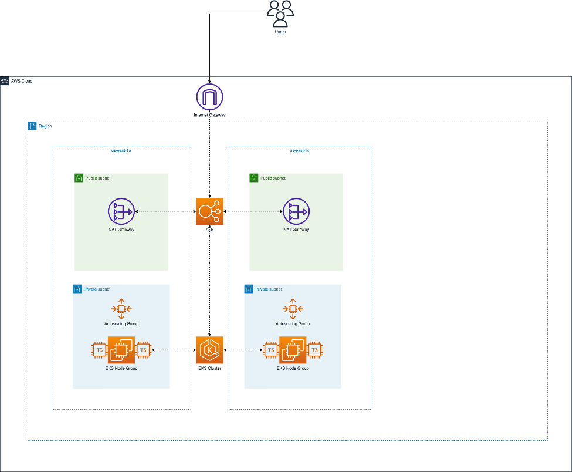

# Solution and considerations

Explanation for the chosen solution and configurations:

#### AWS EKS Cluster
The AWS EKS Cluster is hosted in a VPC on AWS. The overall architecture of the VPC and EKS cluster is shown in the picture below, with the only difference that the VPC has been [configured](https://github.com/lorenzo85/sre-challenge/blob/b6af4e40b04aa9b103928c668f8de436c1d1ebe2/infrastructure/vpc.tf#L21) with 3 AZs instead and in a different region:



The Private Subnets host the Kubernetes cluster and the public ones provide NAT Gateways and Internet Gateways to allow egress internet traffic from the private subnets.

An Application Load Balancer provides ingress connectivity to applications deployed on the Kubernetes cluster (via Traefik ingress controller).

The AWS EKS cluster (configured using the Terraform [EKS module](https://registry.terraform.io/modules/terraform-aws-modules/eks/aws/latest)) has node groups spanning 3 Availability Zones in the **[private](https://github.com/lorenzo85/sre-challenge/blob/484b0327b0908fdc31c8a98e1df892df085f74bb/infrastructure/eks.tf#L18)** subnets within the VPC.

The cluster is configured with **three** different managed node groups:
1. **[Workload](https://github.com/lorenzo85/sre-challenge/blob/484b0327b0908fdc31c8a98e1df892df085f74bb/infrastructure/eks.tf#L28)**: used for normal workloads e.g running applications such as ArgoCD, Cert Manager, Grafana and any other application which does not require specific VMs characteristics (e.g dedicated CPU/Memory). VMs of this node group are general purpose family types such as t3.small, t3.medium, t3.large and so on. 
2. **[Database](https://github.com/lorenzo85/sre-challenge/blob/484b0327b0908fdc31c8a98e1df892df085f74bb/infrastructure/eks.tf#L39)**: used for workloads running databases (e.g PostgreSQL). The family type of VMs running in this node group are Database, I/O and/or Memory optimized specifically to run databases workloads (in the configuration for testing purposes I've used t3.small).    
3. **[Large](https://github.com/lorenzo85/sre-challenge/blob/484b0327b0908fdc31c8a98e1df892df085f74bb/infrastructure/eks.tf#L69)**: used for workloads requiring high requirements in terms of CPU and Memory (e.g Retool requires nodes with at least 8x vCPU and 16 GB of memory as described [here](https://docs.retool.com/self-hosted/quickstarts/kubernetes/helm#cluster-size)) 

The Database and Large node groups are [configured](https://github.com/lorenzo85/sre-challenge/blob/f89a343aebdba5053d5c90fd67132358b3edd89b/infrastructure/eks.tf#L55) to taint the nodes they create within each corresponding node pool, for example:
```bash
taints = [
 {
   key    = "workload-type"
   value  = "database"
   effect = "NO_SCHEDULE"
 }
]
```
The **no schedule** effect means that the Kubernetes scheduler won't schedule any workload without having a specific matching toleration in the workload pod's definition.

Nodes created in each node group are also labeled with a workload-type label:
```bash
labels = {
  workload-type = "database"
}
```
With a combination of [**tolerations**](https://kubernetes.io/docs/concepts/scheduling-eviction/taint-and-toleration/) and [**node selectors**](https://kubernetes.io/docs/concepts/scheduling-eviction/taint-and-toleration/) within the workloads pods definitions we are able
to schedule applications specifically only on these nodes, and repel any other workload. An example of taint / node selector
can be found in the Keycloak PostgreSQL DB [configuration](https://github.com/lorenzo85/sre-challenge/blob/f89a343aebdba5053d5c90fd67132358b3edd89b/charts/keycloak/templates/database.yaml#L10), 
deployed in the database namespace. This will make sure the pods running the database will be scheduled only on nodes belonging to the Database node group.

Another example is the [configuration](https://github.com/lorenzo85/sre-challenge/blob/f89a343aebdba5053d5c90fd67132358b3edd89b/charts/retool/values.yaml#L24) for the Retool workload as it requires to run on nodes belonging to the Large node group.

The node groups described above are configured with different min_size(s) (for testing purposes Large node group was set to max 1). To guarantee resiliency it is important to have min_size >= 2, so that there are at least 2 nodes running each workload on 2 distinct AZs, provided workload pods define a correct [topology spread constraint](https://kubernetes.io/docs/concepts/scheduling-eviction/topology-spread-constraints/) in their definition.
The max_size defines the max number of nodes that can be created in that node group. The number of nodes in the pool is controlled by the [Kubernetes Autoscaler](https://docs.aws.amazon.com/eks/latest/userguide/managed-node-groups.html) which adjusts the number of nodes in the pool according to a set of specified [criterias](https://kubernetes.io/docs/tasks/run-application/horizontal-pod-autoscale/) (e.g avg cpu or memory).

The EKS cluster is configured with the Terraform [**ebs-csi driver**](https://docs.aws.amazon.com/eks/latest/userguide/ebs-csi.html) addon, which is needed to create AWS EBS volumes automatically whenever a PersistentVolume and PersistentVolumeClaim resources are defined in the cluster.
The **ebs-csi** addon deploys a kubernetes.io/aws-ebs provisioner, for EBS volumes with type gp2. We can inspect the provisioner by running the following in the cluster:
```bash
> kubectl get storageclasses.storage.k8s.io 
NAME            PROVISIONER             RECLAIMPOLICY   VOLUMEBINDINGMODE      ALLOWVOLUMEEXPANSION
gp2 (default)   kubernetes.io/aws-ebs   Delete          WaitForFirstConsumer   false               
```
On production, it is advisable to configure reclaim policy to **Retain** so that if the PV and PVC are deleted a backup can be performed before deleting the volume.  
The AWS ebs-csi driver can also be configured to provision [EFS volumes](https://docs.aws.amazon.com/eks/latest/userguide/efs-csi.html) for use cases where a storage needs to be shared and mounted on several VMs and Avaialbility Zones within a region (e.g File share).

#### Traefik configuration
Traefik provides an Ingress controller for the Kubernetes cluster, and it has been [configured](https://github.com/lorenzo85/sre-challenge/blob/4bc072336a18b50eec24491187191819d0814964/charts/traefik-ingress/values.yaml#L14) with the following annotation:
```bash
service.beta.kubernetes.io/aws-load-balancer-type: alb
```
This allows to provision an AWS Application Load Balancer when the Traefik service (with type LoadBalancer) is deployed on the cluster.

#### Cert Manager configuration
Cert Manager has been [configured](https://github.com/lorenzo85/sre-challenge/blob/4bc072336a18b50eec24491187191819d0814964/charts/cert-manager/templates/clusterissuer.yaml#L6) with a cluster wide issuer, to generate self signed certificates whenever a new certificate request is deployed on the cluster.
This is only for testing purposes, on production environment the actual issuer implementation should be changed to use any from the supported [issuers](https://cert-manager.io/docs/configuration/issuers/) such as:
- AWS Private Certificate Authority
- Venafi TLS Protect
- ACME
- Letsencrypt
- ....

It is interesting to notice that installing Cert Manager **after** ArgoCD on the cluster, it still provisions a certificate for ArgoCD (argocd.sre-challenge.com) automatically. 
This is probably because during startup cert manager performs a lookup of the existing ingress definitions in the cluster 
searching for the `cert-manager.io/cluster-issuer: selfsigned-cluster-issuer` annotations and provisions the certificates accordingly if they are missing.  

#### PostgreSQL configuration
PostgreSQL is configured using the [Cloud Native PostgreSQL](https://cloudnative-pg.io/) in the `database` namespace.
CloudNativePG is a Kubernetes operator that covers the full lifecycle of a highly available PostgreSQL database cluster with a primary/standby architecture, using native streaming replication.
CloudNativePG manages master and read replicas automatically and transparently manages fail-overs in case the master database goes down. It exposes
3 kubernetes services for each application which are: read-write, read-only and read endpoint. We can verify this by running:
```bash
> k get svc -n database
NAME                   TYPE        CLUSTER-IP       EXTERNAL-IP   PORT(S)    AGE
cnpg-webhook-service   ClusterIP   172.20.236.252   <none>        443/TCP    1h41m
keycloak-db-r          ClusterIP   172.20.232.184   <none>        5432/TCP   1h37m
keycloak-db-ro         ClusterIP   172.20.195.48    <none>        5432/TCP   1h37m
keycloak-db-rw         ClusterIP   172.20.134.145   <none>        5432/TCP   1h37m
retool-db-r            ClusterIP   172.20.173.191   <none>        5432/TCP   109m
retool-db-ro           ClusterIP   172.20.217.175   <none>        5432/TCP   109m
retool-db-rw           ClusterIP   172.20.103.218   <none>        5432/TCP   109m
```
Read-only replicas can be used to connect data analytics/reporting applications.

All databases (keycloak, retool) are deployed in the `database` namespace as well. Having DB resources in the same namespace is 
useful for instance to define cluster network policies (restrict access to the services only from certain pods with labels selector in the network policy), better monitor resources running databases as they are a critical 
part of the infrastructure and also allow to define consistent and generic backup policies to be applied on database 
namespace resources.

#### Keycloak configuration
Keycloak is configured with an Ingress resource, exposing the app on **keycloak.sre-challenge.com** over HTTPs.

The certificate is automatically provisioned by cert-manager when the Keycloak Ingress is installed.

This is achieved by adding the following [annotation](https://github.com/lorenzo85/sre-challenge/blob/4bc072336a18b50eec24491187191819d0814964/charts/keycloak/values.yaml#L35) to the Keycloak Ingress resource:
```bash
cert-manager.io/cluster-issuer: selfsigned-cluster-issuer
```
Keycloak uses a database deployed using CloudNativePG [cluster](https://github.com/lorenzo85/sre-challenge/blob/4bc072336a18b50eec24491187191819d0814964/charts/keycloak/templates/database.yaml#L3) resource in the database namespace.

#### Retool configuration

Retool application is configured with an Ingress resource, exposing the app on **retool.sre-challenge.com** over HTTPs.

The certificate is automatically provisioned by cert-manager when the Retool Ingress is installed using the same [annotation](https://github.com/lorenzo85/sre-challenge/blob/4bc072336a18b50eec24491187191819d0814964/charts/retool/values.yaml#L42) `cert-manager.io/cluster-issuer`.

In order to schedule Retool on nodes from the **Large** node group we are using a node selector on label *workload-type=large* and [tolerations](https://github.com/lorenzo85/sre-challenge/blob/4bc072336a18b50eec24491187191819d0814964/charts/retool/values.yaml#L24).

Retool uses a database deployed using CloudNativePG [cluster](https://github.com/lorenzo85/sre-challenge/blob/4bc072336a18b50eec24491187191819d0814964/charts/retool/templates/database.yaml#L3) resource in the database namespace.
Note that in order to connect to the database the fully qualified DNS name of the PostgreSQL cluster Read-Write endpoint must be provided in the retool.config.postgresql configuration, as shown [here](https://github.com/lorenzo85/sre-challenge/blob/4bc072336a18b50eec24491187191819d0814964/charts/retool/values.yaml#L11). 

I did not manage to set up OIDC with Keycloak Authentication in Retool, I believe because it is a feature only available on the **Enterprise Plan** as specified [here](https://docs.retool.com/sso/quickstarts/custom/oidc).

I have however drafted a possible configuration [here](https://github.com/lorenzo85/sre-challenge/blob/4bc072336a18b50eec24491187191819d0814964/charts/retool/values.yaml#L54).

I did however set up Keycloak OIDC Authentication for Grafana, which is essentially very similar to what you would do for Retool, see below.

#### Monitoring
The monitoring chart contains both Prometheus and Grafana to monitor cluster workloads and resources. 

Because we have taints on some nodes it is important to add tolerations to the **Prometheus node exporter** pods, so that they can collect metrics also on tainted nodes as well as shown [here](https://github.com/lorenzo85/sre-challenge/blob/4bc072336a18b50eec24491187191819d0814964/charts/monitoring/values.yaml#L2).

Grafana is exposed with an Ingress resource on **grafana.sre-challenge.com**. Its TLS certificate is provisioned automatically using [cert-manager](https://github.com/lorenzo85/sre-challenge/blob/4bc072336a18b50eec24491187191819d0814964/charts/monitoring/values.yaml#L23) as well.

Grafana has been configured with Keycloak OIDC authentication [here](https://github.com/lorenzo85/sre-challenge/blob/4bc072336a18b50eec24491187191819d0814964/charts/monitoring/values.yaml#L32). 


#### ArgoCD

ArgoCD application is configured with an Ingress resource, exposing the app on **argocd.sre-challenge.com** over HTTPs, the certificate is provisioned by cert-manager using [annotations](https://github.com/lorenzo85/sre-challenge/blob/4bc072336a18b50eec24491187191819d0814964/charts/argocd/values.yaml#L12).

ArgoCD Applications are deployed using argoproj.io/v1alpha1#Application resources, the applications configuration files for
cert-manager, cn-postgresql, keycloak, monitoring, retool and keycloak are defined [here](https://github.com/lorenzo85/sre-challenge/blob/master/applications).

For testing purposes I have deployed ArgoCD applications manually, using for example:
```bash
$ kubectl apply -f applications/application-cert-manager.yaml
```
However, ArgoCD can be configured to sync applications directly from a Git repository. 

#### Final considerations
Please note that all workloads exposing an Ingress controller have been configured using `traefik-ingress` as [ingress class name](https://github.com/lorenzo85/sre-challenge/blob/4bc072336a18b50eec24491187191819d0814964/charts/argocd/values.yaml#L8).
This is mandatory especially if there are multiple ingress controllers deployed in the cluster. The Ingress classes installed on a cluster can be checked using:
```bash
$ k get ingressclasses.networking.k8s.io 
```

## Stack components
Description of each component in the application stack:

### ArgoCD
ArgoCD is a Kubernetes controller responsible for continuously monitoring all running applications and comparing their live state to the desired state specified in the Git repository.
Whenever an application resource definition changes, for instance because a new release is made, the updated resources are automatically synchronized into the Kubernetes cluster.


### Cert Manager
Is a tool to automatically provision SSL certificates whenever a new Ingress resource is created.

### Traefik Ingress
Is a cloud-native HTTP reverse proxy and load balancer which can be used as an Ingress controller for Kubernetes clusters.

When deployed as an ingress controller it becomes target of a Load Balancer (e.g on AWS an ALB or NLB) internal to the Kubernetes cluster which forward the request to a backend service (usually an application/API) within the cluster.

The mapping to a service can be based on the host, request path or other supported criterias.

Traefik Ingress controller provides also SSL Termination capabilities.

### Cloud Native PostgreSQL
A cloud native implementation for PostgreSQL which manages High Availability and data replication within a Kubernetes cluster deployment. 

### Retool
Is a low-code tool to build internal apps, dashboards and CRUD Applications using different data sources. 

### Keycloak
Keycloak is an open source identity and access management solution that can be used as a single sign-on solution across several apps and services. 

### Prometheus and Grafana
Prometheus is a monitoring system collecting Kubernete's nodes data (e.g CPU, Memory). 

It uses a set of node-exporters deployed on each node to retrieve the data and export it to a prometheus server.

Grafana is a data visualization tool which allows to build observability dashboards and alerting based on data collected by Prometheus and other supported sources.
