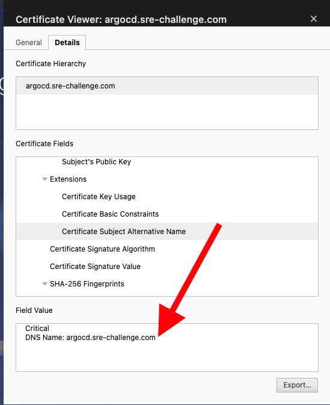

# SRE Challenge
## Installation steps/Configurations

### Tools
Install the following tools:
* Terraform CLI: v1.7.3 
* AWS CLI: v2.15.19 
* kubectl: v1.28 
* Create new AWS Access Key/Secret pair to be used with terraform (credential type - Local code). 
* Export environment variables containing Access and Secret keys:
   ```bash
   $ export AWS_ACCESS_KEY_ID=MY_ACCESS_KEY_ID
   $ export AWS_SECRET_ACCESS_KEY=MY_SECRET_ACCESS_KEY_ID
   ```

### 1. Create the infrastructure

```bash
$ git clone https://github.com/lorenzo85/sre-challenge.git
$ cd sre-challenge

$ terraform -chdir=infrastructure init
$ terraform -chdir=infrastructure apply
```
Wait until the infrastructure has been fully created. This might take up to 15 minutes.
IMPORTANT: The provisioning of the **ebs-csi aws_eks_addon** sometimes gets stuck (!?) Just wait a few minutes and if terraform timeouts, run again:
```bash
$ terraform -chdir=infrastructure apply
```

### 2. Configure Kubernetes cluster context
This is needed in order to create a ~/.kube/config context pointing to the EKS cluster created using terraform in 1. 

This Kubernetes context will allow us to connect to the EKS cluster using `kubectl`:
```bash
$ aws eks --region $(terraform -chdir=infrastructure output -raw region) update-kubeconfig \
          --name $(terraform -chdir=infrastructure output -raw cluster_name)
```
Should see a message saying:
`Added new context arn:aws:eks:... to /your/home/path/.kube/config`

### 3. Ensure cluster is accessible and functioning properly
Run the following commands to list the EKS nodes (should all be with status: **Ready**), and to run a test pod on the cluster printing `Hello sre-challenge`.
Let's also check 
```bash
$ kubectl get nodes
$ kubectl run busybox --image=busybox --restart=Never -it --rm -- echo Hello sre-challenge
```
Let's also check that ArgoCD has been installed correctly. Make sure all pods are in `Running` status:
```bash
$ kubectl get pods -n argo
```

### 4. Install applications
We are going to install the following applications/tools using ArgoCD. We will use a set of manifests resources with type `Application`.
These files can be stored on a repository and let ArgoCD tracking changes automatically, to redeploy a new version of the app.

To simplify first installation we will be running them manually using `kubectl`.
```bash
$ kubectl apply -f applications/application-cert-manager.yaml
$ kubectl get pods -n cert-manager -w
// All cert-manager pods should be in state `Running`

$ kubectl apply -f applications/application-traefik.yaml
$ kubectl get pods -n ingress -w
// All pods in ingress namespace should be in state `Running`

$ kubectl apply -f applications/application-cn-postgresql.yaml
$ kubectl get pods -n database -w
// All pods in database namespace should be in state `Running`

$ kubectl apply -f applications/application-keycloak.yaml
$ kubectl get pods -n identity -w
// All pods in identity namespace should be in state `Running`

// Before installing retool, replace in the application-retool.yaml file the property: spec.sources[0].helm.parameters[0].value with your licenseKey, and then run:
$ kubectl apply -f applications/application-retool.yaml
$ kubectl get pods -n retool -w
// All pods in retool namespace should be in state `Running`

$ kubectl apply -f applications/application-monitoring.yaml
$ kubectl get pods -n monitoring -w
// All pods in monitoring namespace should be in state `Running`
```

### 5. Update /etc/hosts
This is a workaround to resolve (only locally) different domains to the AWS Load Balancer created by the Traefik service.
If we had a registered domain we would create a Route53 record pointing to the Load Balancer instead.
```bash
$ export LB_IP=$(dig +short $(kubectl get svc traefik-ingress -n ingress -o jsonpath='{.status.loadBalancer.ingress[0].hostname}') | tail -n1)
$ sudo -- sh -c "echo $LB_IP argocd.sre-challenge.com >> /etc/hosts"
$ sudo -- sh -c "echo $LB_IP keycloak.sre-challenge.com >> /etc/hosts"
$ sudo -- sh -c "echo $LB_IP retool.sre-challenge.com >> /etc/hosts"
$ sudo -- sh -c "echo $LB_IP grafana.sre-challenge.com >> /etc/hosts"
```

### 6. ArgoCD: check app access
Open the browser to https://argocd.sre-challenge.com/. The HTTPs endpoint will still be seen as an unsecure website,
that's because we configured (for testing purposes only) cert-manager to provision self-signed certificates, 
see [here](https://github.com/lorenzo85/sre-challenge/blob/1237a0fe61dcaadfe8bb7869af1f94f13e1ece7c/charts/cert-manager/templates/clusterissuer.yaml#L6).
If we open the certificate details from the browser, we will see that cert-manager created a certificate and attached it to the
ingress resource exposing ArgoCD with Certificate Subject Alternative Name: **argocd.sre-challenge.com**.



To access ArgoCD use the following credentials. 
Note that the password is stored in a base64 encoded secret in the argo namespace:
- username: admin
- password:
```bash
$ echo $(kubectl get secrets -n argo argocd-initial-admin-secret -o jsonpath='{.data.password}') | base64 -d
```

### 7. Keycloak: check app access
Open the browser to https://keycloak.sre-challenge.com/.
To access Keycloak use the following credentials.
Note that the password is stored in a base64 encoded secret in the identity namespace:
- username: user
- password:
```bash
$ echo $(kubectl get secrets -n identity keycloak -o jsonpath='{.data.admin-password}') | base64 -d
```

### 8. Retool: check app access
Open the browser to https://retool.sre-challenge.com/.

Click on `Need to create a new organization? Sign up.` sign up link.
Create a new user and follow the wizard.

### 9. Grafana: check app access
Open the browser to https://grafana.sre-challenge.com/.

To access Grafana use the following credentials.
Note that the username and the password are stored in a base64 encoded secret in the monitoring namespace:
- username:
```bash
$  bash -c 'echo $(kubectl get secrets -n monitoring monitoring-grafana -o jsonpath=\'{.data.admin-user}\') | base64 -d'
```
- password:
```bash
$  bash -c 'echo $(kubectl get secrets -n monitoring monitoring-grafana -o jsonpath=\'{.data.admin-password}\') | base64 -d'
```
Once logged in configure Prometheus as data source and import a dashboard:

* Configure Prometheus as data source:
  * From Home > Data Sources > Add Data Source
  * Select Prometheus
  * In the **Prometheus server URL** enter: http://monitoring-prometheus-server
  * Save and test
* Import dashboard:
  * From Home > Dashboards > Import Dashboard
  * In the **Find and import dashboards for common applications at** input field, enter: 3662
  * In the next screen select prometheus as data source
  * Click Import

### 10. Grafana - Keycloak 
Grafana - Keycloak oidc authentication can be setup as follows:
From Keycloak create a new client with the following parameters:

**General settings**
- Client type: OpenID Connect
- Client ID: grafana
- Name: grafana
- Click on Next


**Capability config**
- Client authentication: ON (means confidential access type)
- Standard flow: checked
- Direct access grants: checked
- Implicit flow: unchecked
- Service account roles: checked
- Click on Next


**Login settings**
- Root URL: https://grafana.sre-challenge.com
- Home URL: https://grafana.sre-challenge.com
- Valid Redirect URIs: https://grafana.sre-challenge.com/login/generic_oauth/*
- Web Origins: https://grafana.sre-challenge.com/
- Admin URL: https://grafana.sre-challenge.com/
- Base URL: https://grafana.sre-challenge.com/


**Client roles**

In the client details create the roles: admin, editor, viewer:


**Client scopes**

In the client scopes configuration, Assigned Default Client Scopes should match:
- email
- offline_access
- profile
- roles


Assign the roles to a user or user group:


Copy the Client Credentials and the Clent ID:

Clients > Client details > Credentials > Client Secret

Update the Grafana [configuration](https://github.com/lorenzo85/sre-challenge/blob/2ed0310fc46d5bdd675698af23743b12e17134aa/charts/monitoring/values.yaml#L42) with the new client secret and Client ID.

## Uninstall instructions
```bash
$ terraform -chdir=infrastructure destroy
```
